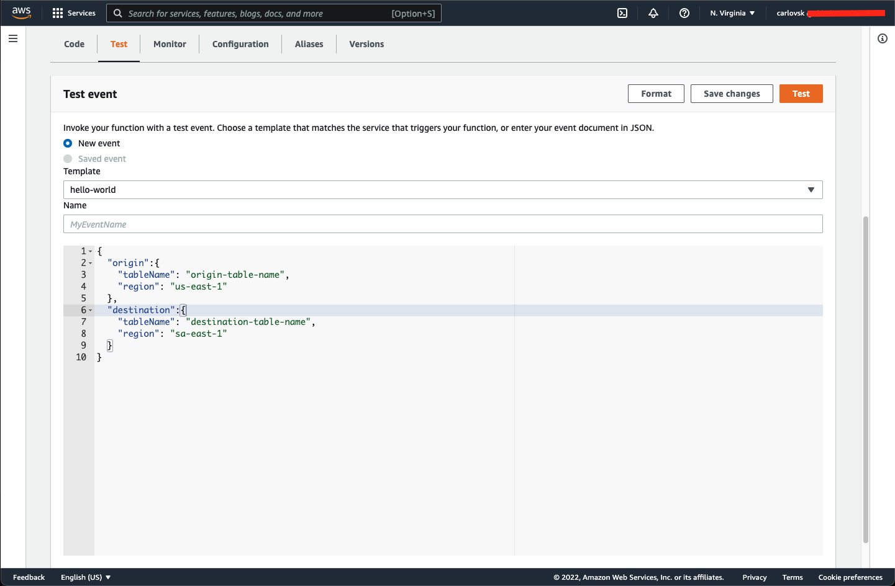

# Copy DynamoDB Table

This project is an AWS Lambda to replicate items from a DynamoDB table to another. It uses very simple API calls through the AWS SDK v3 DynamoDB package. It also supports cross-zone in the AWS regions.

## Use case

This lambda may be much useful when you want to rename a table or replicate it to another region. However, it is just a lambda to scan all the items from an origin table and write them to a destination one. It does not create a new table, so you will need to create it with the required primary and sort keys before running the lambda.

You can also get the lambda code to use it in your own context - maybe parsing the data before writing it to the destination table. The sky is the limit :smile:.

## Installation and Usage

This project is running under the amazing Serverless Stack framework. It means you can easily deploy the lambda through your command line and access it on AWS's Lambda console to run and copy the table you want.

The setup is actually pretty simple. You got to:
- Clone the repo;
- Install the dependencies;
- Export the AWS credentials on your CLI;
- Deploy the app and access it on AWS Lambda's console.

```
# cloning the repo

git clone git@github.com:carlosdnba/copy-ddb-table.git

# installing the dependencies

cd copy-ddb-table

npm i

# exporting credentials

export AWS_ACCESS_KEY_ID=aws-access-key-id
export AWS_SECRET_ACCESS_KEY=aws-secret-access-key

# deploying the lambda

npm run deploy
```

After deploying, you'll some outputs on your terminal. You should find the URL of your deployed lambda, like:

```
✅  carlovsk-copy-ddb-table


Stack carlovsk-copy-ddb-table
  Status: deployed
  Outputs:
    LambdaName: carlovsk-copy-ddb-table-main
    ConsoleUrl: https://console.aws.amazon.com/lambda/home?region=us-east-1#/functions/carlovsk-copy-ddb-table-main?tab=testing
```

Use the `ConsoleUrl` to access your deployed lambda and run it. You will need to send a JSON payload like the one below:

```
{
  "origin":{
    "tableName": "origin-table-name",
    "region": "us-east-1"
  },
  "destination":{
    "tableName": "destination-table-name",
    "region": "sa-east-1"
  }
}
```



After following all steps, your table items should have been successfully replicated :smile:.
